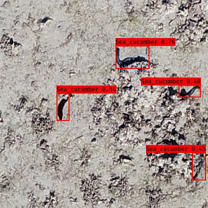

# SeeCucumbers
[](https://twitter.com/joan_lyq)
[](https://github.com/joanlyq/SeeCucumbers)
[](https://github.com/joanlyq/SeeCucumbers)


<!-- TABLE OF CONTENTS -->
<details open="open">
	<summary>Table of Contents</summary>
	<ol>
		<li><a href="#about-the-project">About the Project</a></li>
		<li><a href="#getting-started">Getting Started</a></li>
		<li><a href="#data-preparation">Data Preparation</a></li>
		<li><a href="#training-and-validation">Training and Validation</a></li>
		<li><a href="#detection">Detection</a></li>
		<li><a href="#evaluation">Evaluation</a></li>
		<li><a href="#contact">Contact</a></li>
		<li><a href="#acknowledgements">Acknowledgements</a></li>
	</ol>
</details>

<a name="about-the-project"></a>
## About the Project

This repository contains a tutorial of sea cucumber detection from drone images using YOLOv3, inspired by [qqwweee/keras-yolo3](https://github.com/qqwweee/keras-yolo3).

Here is the detected result sample: 


<a name="getting-started"></a>
## Getting Started

1. The test environment dependencies are
    - Python 3.6
    - Keras 2.2.4
    - tensorflow 1.13.1. 
   The detailed requirements can be checked at [requirements.txt](requirements.txt)

2. Download the repo using following CLI or from current webpage
```
	git clone https://github.com/joanlyq/SeeCucumbers.git
```

3. Download YOLOv3 [pretrained weights](https://pjreddie.com/media/files/yolov3.weights). 

4. If you only want to test the detection result, download the [final weights](https://cloudstor.aarnet.edu.au/plus/s/fnZEJAw6TmHRkc3) to `model_data/` and start from [detection](#detection).
	
<a name="data-preparation"></a>
## Data preparation
* Crop the raw images into the size that can be trained and detected on using default YOLOv3 model:

```
	python crop_img.py
```

<small> *Note: if you want to train the model using your own images, please copy your image collection into `image/raw` and change the image resolutions according to your own.* </small>

* Convert yolo.weights to the `.h5` format that can be used by the keras-yolov3 implementation:

```
	python convert.py -w yolov3.cfg yolov3.weights model_data/pretrained-COCO.h5
```
<a name="training-and-validation"></a>
## Training and Validation
Once the pre-trained weights are converted and images are cropped, you can start training by simply running:   

```
	python train.py
```

The result will be saved in `model_data/` as `sc_final.h5`.

* Hyperparameters (learning rate, training from scratch, etc.) can be tuned in `train.py`.
* Customed anchor boxes can be generated using `kmeans.py`. 

<small>*Note: the training dataset containes 6000 cropped images (80% for training, 20% for validation) as it is the best result obtained so far. If you'd like to test different size of training dataset, please change `step` accordingly in `training_set_generator.py`.*  </small>


<a name="detection"></a>
## Detection
After the training is done, run: 

```
	python detect.py
```

<a name="evaluation"></a>
## Evaluation
The performance was evaluated using mean Average Precision (mAP) adopted from [ashish-roopan/mAP](https://github.com/ashish-roopan/mAP) on 608 cropped images that were never used in the training and validation section. 

Change the `annotation_path` in `detect.py` and `score` in `yolo.py` according to the comments for mAP calculation.

<a name="contact"></a>
## Contact
If you have any questions or would like to contribute to this repo, please contact through [email](mailto:joan.li@my.jcu.edu.au) or [twitter](https://twitter.com/joan_lyq).

<a name="acknowledgements"></a>
## Acknowledgements
I would like to thank Dr. Karen Joyce, Dr. Stephanie Duce for brining me into this project. I would also like to thank Todd McNeill for his help in collecting drone imagery (full image collection can be found [here](data.geonadir.com));Dr. Jane Williamson and other volunteers for their help in labelling the dataset. 

* Other usefull links that inspired me:
	* [YOLO website](https://pjreddie.com/darknet/yolo/)
	* [gustavovaliati/keras-yolo3](https://github.com/gustavovaliati/keras-yolo3)
	* [AlexAB/darknet](https://github.com/AlexeyAB/darknet#how-to-train-to-detect-your-custom-objects)